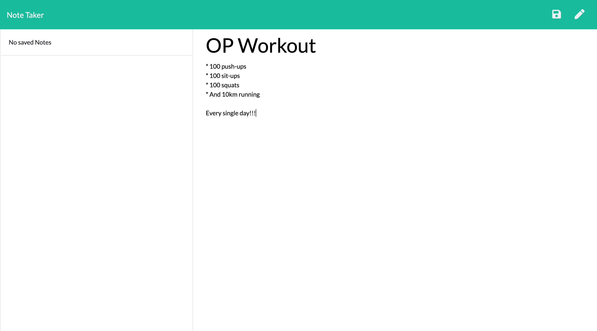
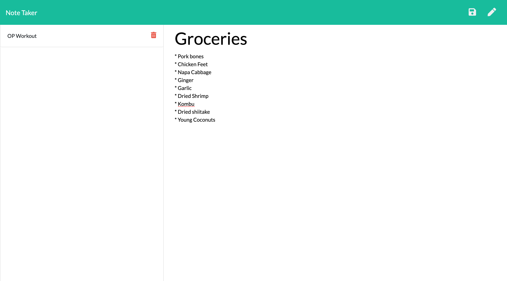

# Weather App 

## AUTHOR

Edward Reyes

## CONCEPT
This app uses express.js to get and post notes to a json file, allowing users to add, save, and delete notes.

## Process    
  ### Back End Development
  * Learned to work with express to create routes get and post data and send appropriate responses depending on the situation.

### Technologies used:  
  HTML, CSS, Bootstrap, JavaScript, Express.js, jQuery

## CHALLENGES
  * Working with preset code and figuring out what is needed to be done based on what is already given.

## LINK TO DEPLOYED APPLICATION / GITHUB

[Heroku Deployed Site](https://afternoon-reef-26658.herokuapp.com/)

## Screen shots

### Final result

